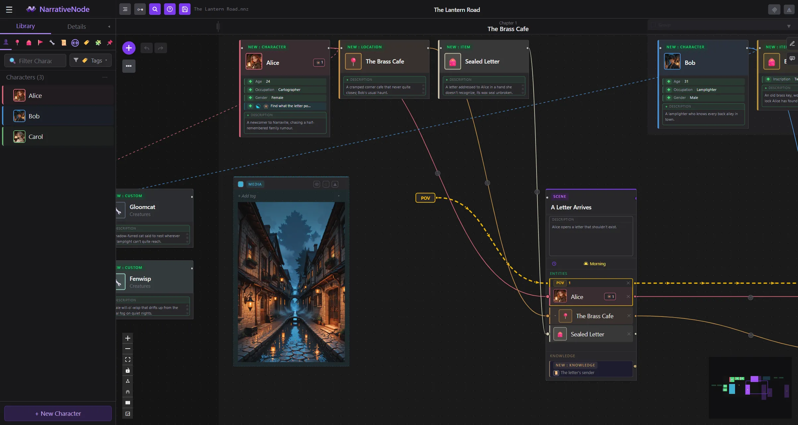

<p align="center">
  
</p>

# NarrativeNode

**A visual plot planner for writers. Built like a node editor, designed for storytellers.**

<p align="center">
  
</p>

> ## Welcome to NarrativeNode!
>
> Hey! NarrativeNode is the first project of this scale that I've put out publicly. I'm a new solo developer, and I've been building it for months, so releasing it is equal parts exciting and nerve-wracking.
>
> I really hope you find it useful, and I'd genuinely love to hear what you think. Thanks for taking a look! 😄
>
> ~ Carasibana

---

## What is it?

NarrativeNode is a planning tool for writers who are building complex stories. Instead of juggling separate character sheets, timeline spreadsheets, and scattered notes, you plan your entire story in one visual workspace: a canvas where each scene is a node, and the lines connecting nodes show exactly how characters, objects, and locations move through the narrative.

Think of it as a flowchart for your story, where every box knows the state of every person and thing inside it -- and where recording a change in scene 3 automatically carries that change forward to every scene after it.

If you have used tools like ComfyUI or Blender's node editor, the interface will feel immediately familiar. If you haven't, the core idea is simple: each element of your story lives in its own node. You connect the nodes to show how the story flows. You can see the whole plot at once, zoom into a single moment, or follow any single character's thread from their first appearance to their last without losing sight of the rest.

---

## What problem does it solve?

Planning a story with one character and a simple timeline is straightforward. Most stories are not like that.

The moment you add a second point-of-view character, a flashback, a faction with competing loyalties, or an item that changes hands three times, the whole thing starts to slip. Traditional tools were not built for this:

- **Character sheets** capture who a character is at the start, not how they change. You have to manually update every document every time something happens to them -- and manually cross-reference those changes against every later scene.
- **Index cards and outlines** show the plot structure but not the state of the world at each scene. Who is in the room? What do they know? What are they carrying?
- **Spreadsheets** can track state changes in theory, but they show no shape, they fall apart the moment timelines go non-linear, and they tell you nothing about relationships between entities at any given moment.
- **Prose writing apps** are for writing, not planning. Using the same tool for both makes each harder.

NarrativeNode treats your story as a living graph. The state of every character, location, and item is computed automatically at every scene by following the chain of changes you have defined from the beginning. You define an entity's starting state once, then record what changes at each scene where they appear. Every downstream scene automatically reflects those changes, and if two changes contradict each other, the app flags it for review rather than silently breaking your continuity.

The other core problem NarrativeNode solves is the gap between **temporal order** (what actually happens in the story world, and when) and **narrative order** (the sequence a reader experiences). The canvas always shows temporal order, so you can plan the full world timeline visually. The POV system lets you route the narrative through that timeline however you want: flashbacks, non-linear cuts, scenes that happen off-screen. When you export, the output follows the POV sequence, not the canvas layout, so the reader gets the order you intended.

---

## Core concepts

Three ideas make the rest of the app click into place.

### 1. The canvas shows time. The POV path defines the story.

Scenes on the canvas are arranged in temporal order: the order things happen in the story world. Parallel events sit side by side. You can see the whole timeline at a glance.

The POV system is separate. You mark which character is carrying point-of-view at each scene. That sequence defines the narrative order: the order a reader encounters events. Export follows the POV order, not the canvas layout. A flashback that is chronologically the earliest event in your story can be placed in chapter six just by where you route the POV character through it.

Scenes with no POV character are off-screen: they are part of the world timeline, but the reader does not witness them directly.

### 2. Entities have history, not just state.

Every character, location, item, faction, and custom element in your story is an **entity**. Each entity is defined once, at a **Setup Node** on the canvas: name, colour, description, and whatever custom attributes you want to track.

After that, entities do not have a global state you go back and edit. Instead, you record what changes at each scene. A character gets injured: add that change at that scene node. An item changes hands: record it there. A name change, a new relationship, an attribute removed: all of it is recorded at the scene where it happens, not retroactively.

The app computes each entity's effective state at any scene by walking from its Setup Node forward through the connection graph, applying changes in order. You can look at any scene and see exactly what every entity looked like at that specific moment in the story.

### 3. Changes propagate forward, and conflicts surface automatically.

When you record a change to an entity at a scene, it flows forward to every subsequent scene. If you later realise that change should have happened one scene earlier, you move it and the propagation updates itself.

If a downstream scene already had its own version of that change recorded, it is flagged with a warning indicator. Nothing is blocked or broken: the flag just says "this might need a second look." You address flags at your own pace.

---

## Features

### Canvas and scenes

- Infinite zoomable canvas for arranging scenes in any layout
- **Scene nodes** with a title, a short summary visible directly on the node, and a full rich-text content area in the sidebar
- **Entity chips**: each scene node holds coloured sub-sections, one per entity present at that scene; chips show the entity's state at this point in the narrative
- **Wiring**: drag from any entity chip to connect it to the next scene; each wire can carry a transition note (travel method, time skip, motivation, anything relevant to the transition)
- Each entity follows a single linear path: one outgoing connection per chip, one scene to the next; entities can skip scenes freely, but each entity chip can only continue forward to one scene at a time
- No restrictions on which entity types can appear together in a scene, or how many scenes any entity can appear in
- **Chapters and Acts**: group scenes into chapters using column dividers across the canvas; chapters can be organised into acts; groups are used as scope for export
- **Readability controls**: switch between wire-visibility modes, auto-tidy wire routing, preview a wire's transition note inline, and dock or rearrange the side panels

### Scene time

Scenes can optionally record when they happen: time of day, date, season, and duration, against a configurable calendar. This information is available to the timeline views and to any AI context built from a scene.

### Entities

Five built-in entity types, plus a fully configurable custom type:

| Type | What it represents |
|---|---|
| **Character** | Any person or being in the story |
| **Location** | A place; supports parent/child hierarchy (e.g. City > Tavern > Back Room) |
| **Item** | An object that moves through the narrative (a sword, a letter, a map) |
| **Faction** | A group, organisation, or allegiance |
| **Custom** | Anything else; organised by user-defined categories (e.g. "Spells", "Ancient Artefacts", "Goblins") |

Each entity gets:

- A user-chosen **colour** that flows through the entire canvas (wires, chips, and setup nodes all use it)
- A **profile image** (uploaded and cropped in-app)
- A **description**
- Any number of **aliases** (alternative names the entity is known by)
- Any number of custom **attributes**
- **Relationships** to other entities

### Custom attributes

Attributes can be one of five types:

| Type | Description |
|---|---|
| **Text** | Free-form text, as long or short as needed |
| **Media** | Any supported file: image, audio, or video; uploaded and embedded in the project file |
| **Preset** | A selection from a user-defined list (e.g. a "Species" list containing Human, Elf, Dwarf) |
| **Text list** | A list of text values (e.g. a list of nicknames, titles, or tags) |
| **Entity list** | A list of other entities from the story (e.g. A list of friends, a character's inventory, a location's known inhabitants) |

Attributes can be added, modified, or removed at any scene node as part of that scene's change record. The change flows forward from that point.

**Preset lists** are defined at the story level and shared across any entity or attribute that needs them.

### Relationships

Relationships are first-class objects linking entities: an alliance, a rivalry, a family tie, a chain of command. Like an entity, a relationship is defined at an origin and then evolves along the narrative: participants join or leave, perception between participants shifts, roles and hierarchy change. Each change is recorded at the scene where it happens and propagates forward, with the same review-flag system as entity changes. A relationship's state at any scene is shown on the relevant entity chips and in the Detail Panel.

### Knowledge and awareness

NarrativeNode tracks not only what is true in the story but who knows it. **Knowledge** items are discrete facts, secrets, or pieces of information in the world. **Awareness** records which characters are aware of something, and how strongly, at each point in the narrative. Awareness can be tracked against knowledge items, entities, relationships, individual attributes, and names or aliases. Like everything else it is recorded as changes at scenes and computed forward, so you can ask who knows a given secret at a given scene and get an exact answer.

### Circumstances, motivators, and perspectives

Characters can carry richer narrative state than plain attributes:

- **Circumstances** and **motivators**: situational conditions and driving forces, each with a description and an intensity, recorded where they apply.
- **Perspectives**: how a character regards another character or a situation, captured as a described, directed stance.

All three are tracked along the chain like any other change, and they feed the AI chat and character-card features described below.

### Tags

Entities and scenes can be tagged, and a tag filter narrows the canvas and library to what carries a given tag. Tags can be defined per project or kept in a reusable program-level pool.

### Change tracking

At each scene node, every entity chip can record a change layer for that entity at that scene:

- Name changes
- Colour changes
- Description changes
- Profile image changes
- Attribute additions, modifications, and removals
- Relationship additions and removals

Visual indicators on each chip show what kind of change happened at a glance: green for additions, red for removals, amber for modifications. Changes propagate automatically to all downstream scenes.

If a later scene already carries its own change for the same field, that scene gets a review flag. All flags are informational and non-blocking. An **Alerts** panel gathers every outstanding review flag in one place so none get lost.

### POV system

POV is tracked at the character level, not the scene level. At any scene node, you mark which character has point-of-view. This:

- Defines the sequence of the exported document
- Allows fully non-linear storytelling: flashbacks, parallel POV switches, scenes the reader never witnesses
- Supports any POV structure: single POV throughout, multiple rotating POVs, or no POV at all for omniscient narration

The canvas shows temporal order. Export always follows narrative order.

### Left sidebar: Entity Library and Detail Panel

The left sidebar has two modes that switch automatically based on what you are doing.

**Entity Library** is the default view. It shows all the entities in your story organised into tabs: Characters, Locations, Items, Factions, and Custom. Each tab has a search bar and lists every entity of that type with its colour, profile image, and name. From the library you can:

- Create new entities (button at the top of each tab)
- Click any entity to open it for editing in a modal
- Drag an entity from the list directly onto the canvas or onto a scene node to add it there
- Locate an entity's Setup Node on the canvas using the locate button on each row
- Reorder entities within a tab by dragging the grip handle on each row

**Detail Panel** replaces the library view when you select something on the canvas. It is context-aware: clicking a scene node shows a summary of that scene and a list of entity chips present at it; clicking an entity chip within a scene (or selecting an entity node) shows that entity's full detail at that specific point in the narrative chain, including its effective state at that scene with all changes up to that point applied.

From the Detail Panel you can:

- See the entity's name, colour, profile image, description, attributes, and relationships as they stand at the selected scene
- Navigate backward and forward along the entity's chain of scenes using arrow controls (greyed out at the start and end of the chain)
- Jump to the entity's Setup Node or to any scene node that contains it
- Navigate up from a chip to its parent scene
- Navigate down into a related entity at the same chain position (if that entity is not yet in the scene, adding it here triggers the upstream search flow)
- Edit change records for the current scene: add, modify, or remove attribute values at this specific scene node

Switching selection on the canvas updates the Detail Panel immediately. Clicking blank canvas space returns to the Entity Library.

### Text editor

Clicking a scene node opens the **Editor panel** in the right sidebar: a full TipTap rich-text editor for writing the full content of that scene. The editor supports:

- Bold, italic, underline, strikethrough
- Headings (H1, H2, H3)
- Bullet lists and numbered lists
- Blockquotes
- Text colour and highlight
- Font size and font family
- Links

The editor is independent of the left sidebar: you can have the Detail Panel open on the left and be writing in the editor on the right at the same time. Closing the editor does not discard content; everything saves with the project.

**Entity name highlighting**: while writing in the editor, entity names are automatically highlighted in their entity colour as visual overlays directly in the text. This is non-destructive: the stored text content is never modified; the highlights are purely visual decorations applied on top. Only entities present in the currently open scene are matched, so the highlighting is scoped to who is actually at this scene. Clicking any highlighted name opens that entity in the Detail Panel on the left at the current scene's chain position. If a name change was recorded for an entity at this scene, both the entity's incoming name and its new name are highlighted independently, each shown in the relevant colour and state.

### Reference nodes

Freestanding canvas nodes for notes, annotations, and reference material that are not tied to the entity or scene system. A reference node can hold rich text or an embedded media file (image, video, or audio). Use them for world-building notes, mood boards, chapter outlines, or any other material you want on the canvas without it being part of the narrative structure. Reference nodes are resizable, collapsible, and can be placed anywhere on the canvas.

### Search and find / replace

Global search jumps to any entity, scene, knowledge item, or relationship across the whole project from a single box. A separate find-and-replace tool works across scene text content.

### Table of Contents

A flyout panel anchored to the chapter header row at the top of the canvas. Shows the full story structure hierarchically: Acts contain Chapters, Chapters list their scenes in POV narrative order. Clicking any entry pans and zooms the canvas to that scene or chapter column. Useful for quickly navigating large stories and getting a structural overview without scrolling.

### Timeline Navigator

A resizable flyout panel showing a grid of all entities against all scenes in the story. Each row is an entity; each column is a scene; each cell shows whether that entity appears at that scene. Filter rows by entity type or search by name. Clicking any cell navigates the canvas to that scene and opens the entity's detail panel at that chain position. Useful for spotting gaps in a character's journey or checking which scenes a particular item or location appears in.

### Media preview panel

A floating panel for inspecting attached media. When you open a media file attached to an entity attribute, it appears in the preview panel at a comfortable size, with playback controls for audio and video files.

### Entity import

Import entities from another `.nnz` project file. A preview shows exactly what will be imported and how each entity maps to your current story before anything is committed.

### Novelcrafter import

Bring in a story written in Novelcrafter: import its prose (Markdown, HTML, or DOCX) and each scene's text lands in the matching scene node, ready to keep planning around.

### Export

The Export dialog lets you choose a scope (full story, specific acts, specific chapters) and a format:

| Format | Notes |
|---|---|
| **Markdown** | Clean `.md` document in narrative order |
| **HTML** | Static website with navigation |
| **Plain text** | Simple `.txt` document |
| **PDF** | Formatted PDF |
| **DOCX** | Microsoft Word compatible (also opens in LibreOffice / OpenOffice / Google Docs) |
| **NovelCrafter Markdown** | Compatible with NovelCrafter's scene import |
| **NovelCrafter DOCX** | NovelCrafter-compatible Word document |

All formats follow the POV narrative order, not the canvas layout.

### Character cards

Export any character as a SillyTavern-compatible character card (a PNG with the card data embedded), built from the character's effective state at a scene you choose, with an optional AI-assisted greeting. Character cards can also be imported as entities.

### Settings panel

The Settings panel has five tabs:

- **Story Settings**: title, author, accent colour, chapter and act labels, and other story-level settings saved inside the project file
- **Story Seeds**: define default attribute stubs automatically applied to every new entity created in this project (e.g. a "Mana Type" preset attribute auto-added to every new Character)
- **Default Seeds**: define seeds that are copied into every new project you create; a template, not a live connection to existing projects
- **Program Settings**: app-level preferences
- **About**: version info

### AI chat

An in-app chat panel lets you talk to your story. Chat in character (the model is given a character's effective state at a chosen scene), iterate on a scene, or apply a reply straight into a scene's text. Conversations save with the project and are organised in a thread browser. Bring your own provider: any OpenAI-compatible endpoint, OpenRouter, Anthropic, or a local Ollama or LM Studio server. System prompts are editable and selectable, API keys are stored in your operating system's keychain, and the whole AI layer can be switched off in Program Settings.

### MCP server (AI agent control)

NarrativeNode includes a built-in **Model Context Protocol** server, so external AI clients (Claude Desktop, Claude Code, and any other MCP-compatible client) can read and write your story through a structured tool surface rather than free-form chat.

The MCP surface exposes the same chain-of-history model the app uses: tools accept an optional `at` argument naming a scene, and changes are recorded as chain entries at that scene rather than rewriting the origin. Reads return the entity's effective state at the named scene, with everything upstream applied.

Agents request a session before making any changes. While a session is active, an in-app indicator shows what the agent is doing, and the session can be ended at any time from within the app. Built-in workflow guides (discoverable through the `list_workflows` tool) walk an agent through common tasks like setting up a story from scratch, planning a plot, or drafting prose.

The MCP server can be started on demand from the MCP control button, or set to launch automatically with the app in Program Settings.

#### Setting up Claude Desktop or Claude Code

NarrativeNode ships a tiny stdio wrapper (`backend/scripts/mcp_stdio_launcher.py`) that MCP host apps spawn as a child process. The wrapper boots clean regardless of whether NarrativeNode is running, so hosts that launch at OS login stop marking `narrativenode` as unhealthy on every boot. Tool calls forward to the live FastMCP server when NN is up; when it's offline they return a friendly inline message instead of crashing.

**Replace `<NN_ROOT>` in every snippet below with the absolute path to your NarrativeNode repo on disk** before pasting. The literal placeholder won't resolve to anything; the host will fail to launch the wrapper. Use forward slashes everywhere — both JSON configs and the Claude Code CLI handle them fine on Windows.

The venv Python lives at:
- **Windows**: `<NN_ROOT>/.venv/Scripts/python.exe`
- **macOS / Linux**: `<NN_ROOT>/.venv/bin/python`

Use the venv Python explicitly — the wrapper depends on the `mcp` package installed in NN's venv, not a system Python.

**Claude Code** (CLI):

```sh
claude mcp add narrativenode \
  <NN_ROOT>/.venv/Scripts/python.exe \
  <NN_ROOT>/backend/scripts/mcp_stdio_launcher.py
claude mcp list                      # verify: ✓ Connected
```

**Claude Desktop**: edit `%APPDATA%\Claude\claude_desktop_config.json` (Windows) or `~/Library/Application Support/Claude/claude_desktop_config.json` (macOS) and add a `narrativenode` entry under `mcpServers`:

```json
"narrativenode": {
  "command": "<NN_ROOT>/.venv/Scripts/python.exe",
  "args": ["<NN_ROOT>/backend/scripts/mcp_stdio_launcher.py"]
}
```

Restart Claude Desktop. The `narrativenode` server will be healthy at boot regardless of whether NarrativeNode is running.

Full setup details, including the `NN_MCP_URL` env-var override for non-default backend ports and a smoke-test script you can run before touching host configs, are in `backend/scripts/README.md`.

### Built-in help

A guided, screenshot-illustrated help system is built into the app: a walkthrough of every panel and concept that you can open from within NarrativeNode. Handy when you are getting your bearings.

### Project file format

Projects save as `.nnz` files: a standard ZIP archive with a custom extension. Inside is `narrative.json` (the full story state) and an `assets/` folder holding any files you have attached to entities. You can open a `.nnz` file with any ZIP tool to inspect or manually back up its contents.

On Windows, `.nnz` files can be registered with the operating system so double-clicking them opens NarrativeNode directly.

---

## Who is it for?

- **Novelists and fiction writers** planning multi-character, multi-timeline stories
- **Game masters and tabletop RPG players** tracking campaign lore, plot arcs, and NPC continuity
- **Screenwriters** managing parallel storylines, flashbacks, and act structure
- **Any writer** whose story has grown too complex to hold in a flat document or spreadsheet

---

## Getting started

### Prerequisites

Install these two runtimes first (both are free):

- **Python 3.11 or newer** — download from https://www.python.org/downloads/
  On Windows, tick **"Add python.exe to PATH"** in the installer so `python` works from the terminal.
- **Node.js 20.19+ or 22.12+** (the LTS build is recommended) — download from https://nodejs.org/
  It includes `npm`, which the setup step uses to build the app's interface.

Check both are available from a terminal before continuing:

```bash
python --version
node --version
```

### First-time setup

Run the setup script once before anything else. It creates the Python virtual environment and installs all dependencies:

```bash
python setup.py
# or on Windows: setup.bat
```

### Starting the app

```bash
python run.py
# or on Windows: run.bat
```

`setup.py` builds the frontend as its last step, so `python run.py` works immediately after setup. It launches the FastAPI backend, which serves the built frontend directly, and opens the app in your default browser.

### A suggested first session

If you are new to the app, this sequence shows the core workflow in about ten minutes:

1. **Create a new project** from the canvas toolbar.

2. **Add some entities** in the Entity Library panel (left sidebar). Create two characters and a location. Each gets its own coloured Setup Node placed on the canvas.

3. **Add a Scene node** using the circular "+" button in the top-left corner of the canvas, or by right-clicking any blank spot on the canvas. Either opens a menu to choose what type of node to add. Give the scene a title and a short summary in the panel that appears.

4. **Wire your entities into the scene**: drag from the output port on a character's Setup Node to the Scene node. The character appears as a coloured chip inside the scene. Repeat for the other character and the location.

5. **Add a second Scene** and wire the entities forward from Scene 1 to Scene 2. The transition wire can carry a note explaining how the entities move from one scene to the next.

6. **Record a change**: open Scene 2 and click on a character chip. Use the change panel to modify the character's description, or add a new attribute like "Injury: fractured wrist". That change now propagates forward to every scene after this one.

7. **Mark the POV**: on Scene 1, click the character chip for your point-of-view character and mark them as carrying the POV for this scene. Do the same for Scene 2. This defines the narrative order for export.

8. **Write in the text editor**: click a Scene node to open it in the rich-text editor in the right sidebar. Write out the scene however you like.

9. **Export**: open the Export dialog from the toolbar. Choose a file format and export the story. The output follows the POV narrative order.

---

## Tech stack

| Layer | Technology |
|---|---|
| Backend | Python 3.11+ / FastAPI / Pydantic v2 |
| Frontend | React 19 / Vite 8 |
| Node canvas | React Flow (`@xyflow/react` v12) |
| Rich text editor | TipTap 3 |
| Image cropping | react-easy-crop |
| Styling | Tailwind CSS v4 |
| State management | Zustand 5 |
| HTTP client | Axios |
| Export renderers | ReportLab (PDF), python-docx (.docx) |
| Save format | `.nnz` (ZIP archive containing JSON and assets) |

---

## Licence

NarrativeNode is **source-available** under a custom licence. It is **not** an OSI-approved open-source licence. The full terms are in [LICENCE.md](LICENCE.md). In brief:

- **Personal use is free.** Plan and write your stories. You own everything you create with it; the project claims no rights in your narrative content.
- **Modify it for yourself** and share your changes as patches or diffs. Keeping a private copy or private fork is fine.
- **No redistributing, rehosting, rebranding, or reusing the code in another software product.**
- **A commercial licence is required only when a project is *both*** undertaken for a commercial purpose *and* by an established earner (over CAD $250,000 gross in the trailing twelve months). That test applies to your active use and is never applied retroactively, so hobby work and a newcomer's first commercial work owe nothing.

See [LICENCE.md](LICENCE.md) for the terms that actually govern.

---

## Credits and open-source libraries

NarrativeNode is built on several excellent open-source libraries. Thank you to their authors and contributors.

| Library | License | Notes |
|---|---|---|
| [React](https://react.dev/) | MIT | UI framework |
| [Vite](https://vitejs.dev/) | MIT | Build tool and dev server |
| [React Flow / xyflow](https://reactflow.dev/) | MIT | Node-based canvas |
| [TipTap](https://tiptap.dev/) | MIT | Rich text editor |
| [react-easy-crop](https://github.com/ValentinH/react-easy-crop) | MIT | Profile image cropping |
| [Tailwind CSS](https://tailwindcss.com/) | MIT | Utility-first CSS framework |
| [Zustand](https://github.com/pmndrs/zustand) | MIT | State management |
| [Axios](https://axios-http.com/) | MIT | HTTP client |
| [Streamdown](https://github.com/vercel/streamdown) | Apache-2.0 | Streaming-aware markdown rendering in the AI chat panel (block-level memoisation, mid-stream syntax repair; bundles remark-gfm + the unified pipeline) |
| [@streamdown/mermaid](https://github.com/vercel/streamdown) | Apache-2.0 | Streamdown plugin that detects `language-mermaid` fenced blocks and routes them to Mermaid for inline SVG rendering in the chat panel |
| [Mermaid](https://mermaid.js.org/) | MIT | Inline diagram rendering for AI-emitted character / plot / scene-flow visualisations |
| [marked](https://github.com/markedjs/marked) | MIT | Markdown to HTML conversion (used by Apply to Editor Section to convert chat-message markdown into TipTap-compatible HTML before writing into a Section) |
| [DOMPurify](https://github.com/cure53/DOMPurify) | Apache-2.0 (also available under MPL-2.0; we ship under Apache-2.0) | HTML sanitization for user-provided rich-text content; primary consumer is the Novelcrafter prose import (`novel.md` / `novel.html` / `novel.docx` → `SceneNode.main_content`), used as a defence-in-depth allow-list filter before the HTML reaches TipTap |
| [@uiw/react-color](https://github.com/uiwjs/react-color) | MIT | Colour picker components (saturation square, hue slider) |
| [FastAPI](https://fastapi.tiangolo.com/) | MIT | Backend web framework |
| [Pydantic](https://docs.pydantic.dev/) | MIT | Data validation |
| [uvicorn](https://uvicorn.dev/) | BSD | ASGI server |
| [aiofiles](https://github.com/Tinche/aiofiles) | Apache-2.0 | Async file I/O in the backend |
| [python-multipart](https://github.com/Kludex/python-multipart) | Apache-2.0 | Multipart form / file-upload parsing for FastAPI endpoints |
| [ReportLab](https://www.reportlab.com/) | BSD | PDF export |
| [python-docx](https://python-docx.readthedocs.io/) | MIT | .docx export |
| [keyring](https://github.com/jaraco/keyring) | MIT | OS keychain storage for AI provider API keys (Windows Credential Manager / macOS Keychain / Linux Secret Service) |
| [markdown-it-py](https://github.com/executablebooks/markdown-it-py) | MIT | Markdown to HTML for free-form export text fields (descriptions, attribute values, notes, etc.), so markdown a writer types into those fields renders in the PDF / DOCX / HTML exports; same CommonMark/GFM family as `marked`. Bundles mdurl (MIT) |
| [mcp](https://github.com/modelcontextprotocol/python-sdk) | MIT | Model Context Protocol Python SDK; powers NarrativeNode's MCP server so MCP-capable AI clients can drive the app through tools |
| [resvg-py](https://github.com/baseplate-admin/resvg-py) | MIT | SVG to PNG rasterization for export iconography; wraps the resvg Rust crate (dual Apache-2.0 / MIT), all bundled native code permissive |

The full licence text for each library above is included in the [THIRD_PARTY_LICENSES/](THIRD_PARTY_LICENSES/) folder.

---

## A note on this project's creation

This project was created using Claude Code.  Thank you Anthropic! <3
If that's a dealbreaker, please feel free to move on.
